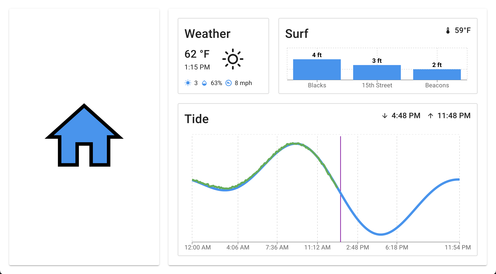

# Garage-UI-Mountain-Edition

## A Custom UI For A Garage Door Opener



## About Project
This project is an another flavor of the original Garage-UI available [here](https://github.com/mrrosoff/Garage-UI). This Garage-UI is the Mountain Edition. It allows users to see the current/forecasted weather, ski conditions, total snowfall, and show live feeds from a ski resort of their choice, all at a glance. Currently, this project does ***not*** open or close a garage door.

This project is an Electron app that runs on a Raspberry Pi. The app is designed to be used with a 10"/12" touch screen. For a suggested list of hardware for this project visit this link.

### Installation

Clone the repository and run the [install script](scripts/install.sh). This will install the dependencies, build the app, and change your Raspberry Pi to auto update itself and auto launch to Garage-UI-Mountatin-Edition. ⚠️ ***Make sure to run the script in the Garage-UI-Mountatin-Edition directory.***

### Environment Variables

The project uses environment variables to store API keys and other sensitive information. The following environment variables are required to run the project:

```javascript
// Coordinates for the weather API
VITE_LATITUDE=40.4850 
VITE_LONGITUDE=-106.8317

// For quick start, use ski id 6 for Steamboat Springs, CO
VITE_SKI_RESORT_ID= // Your ski resort id

// How often to hit the API's in milliseconds
VITE_TIME_INTERVAL=60000

// Youtube Button Link and Title
VITE_YOUTUBE_LIVE_STREAM_LINK= // Your live stream link
VITE_LIVE_STREAM_BUTTON_TITLE= // Your live stream title
```